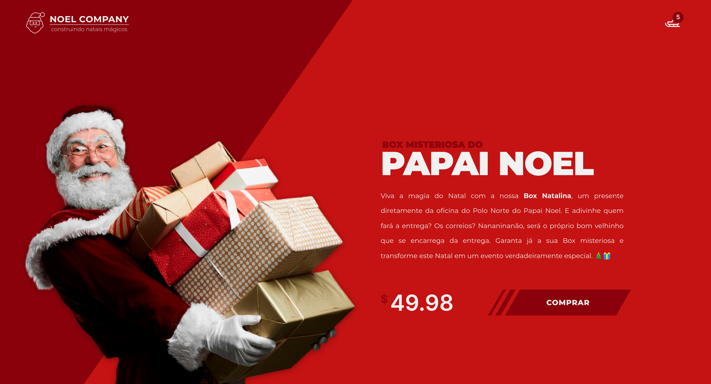

<h1 align="center">
  Box Misteriosa do Papai Noel
</h1>

  

## 💻 Projeto

Neste tutorial, vamos criar o site oficial do Papai Noel utilizando _HTML_, _CSS_ e _JavaScript_! 🎅✨ Descubra passo a passo como desenvolvemos uma encantadora landing page que destaca a venda da misteriosa box do Papai Noel. 🎁💻

## 🚀 Tecnologias

- HTML
- CSS
- JavaScript
- [AOS Animate](https://michalsnik.github.io/aos/)
- [Particles.js](https://particles.js.org/)

## 📔 Conhecimentos abordados

- [x] Uso semântico do HTML
- [x] Váriaveis do css no `:root`
- [x] Animações com a biblioteca [AOS](https://michalsnik.github.io/aos/)
- [x] Animações com a biblioteca [particles.js](https://particles.js.org/)
- [x] Uso do CSS Flexbox
- [x] Efeitos com a propriedade `transform` do css
- [x] Manipulação de arquivos de audio
- [x] Responsividade

## 📺 Tutorial no Youtube

